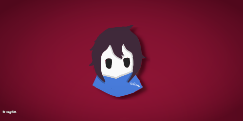

<p align="center">

 </p>

<p align="center">
  <a href="https://github.com/DenverCoder1/readme-typing-svg"></a>
</p>
    
|**Prefix**: !|**Developer:** [@K1ngAG](https://github.com/kingdevag)|**Lang:** ES/EN|**Library:** [Nextcord](https://github.com/nextcord/nextcord)|[Discord Guild](https://discord.com/invite/PatBCfNs5D)|[Bot Invite Url](https://discord.com/oauth2/authorize?client_id=933860473068195900&permissions=8&scope=bot)|**Runtime**: python-3.9.1
|---|---|---|---|---|---|---|
    
<h2 align="center">
    Requirements
    
</h2>
    
1. Discord Bot Token **[Guide](https://nextcord.readthedocs.io/en/stable/discord.html)**
2. YouTube Data API v3 Key **[Guide](https://developers.google.com/youtube/v3/getting-started)**  
3. Nextcord v2.0.0a7 or newer
    
## 🚀 Getting Started

```sh
git clone https://github.com/kingdevag/AkazaDBot.git
cd AkazaDBot
pip install -r requirements.txt
```
    
## ⚙️ Configuration

Create a file called .env

⚠️ **Note: Never commit or share your token or api keys publicly** ⚠️
the .env file must contain:
    
```dotenv
token=your DISCORD TOKEN
key=your YOUTUBE_API_KEY
version=the version of your bot
password=your bot's password
host=dev
hook=Link of your webhook (Optional)
```
